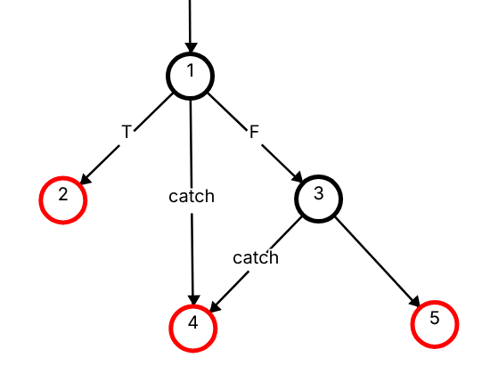
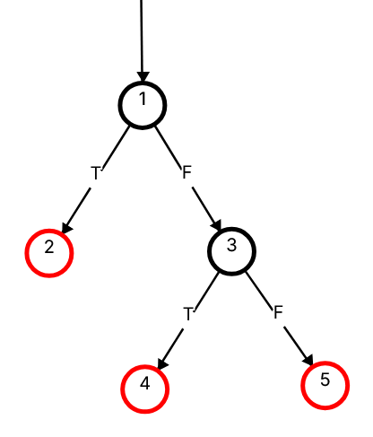
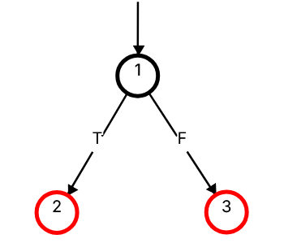
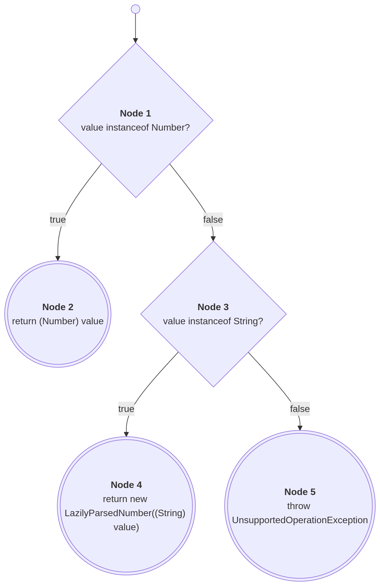
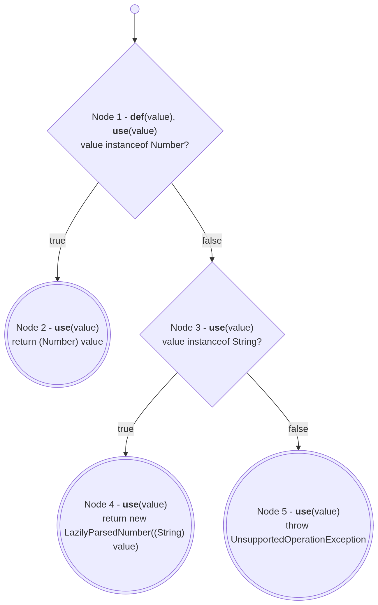
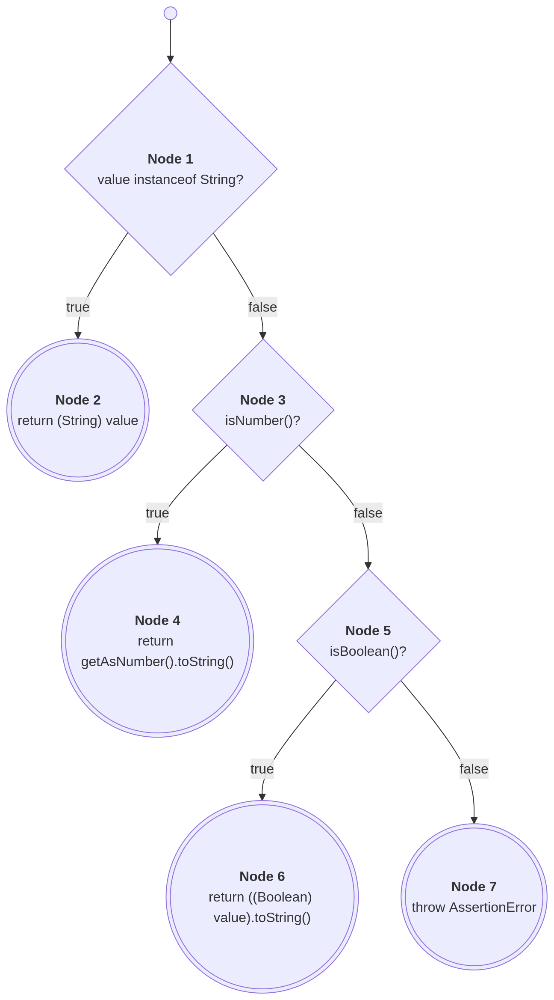
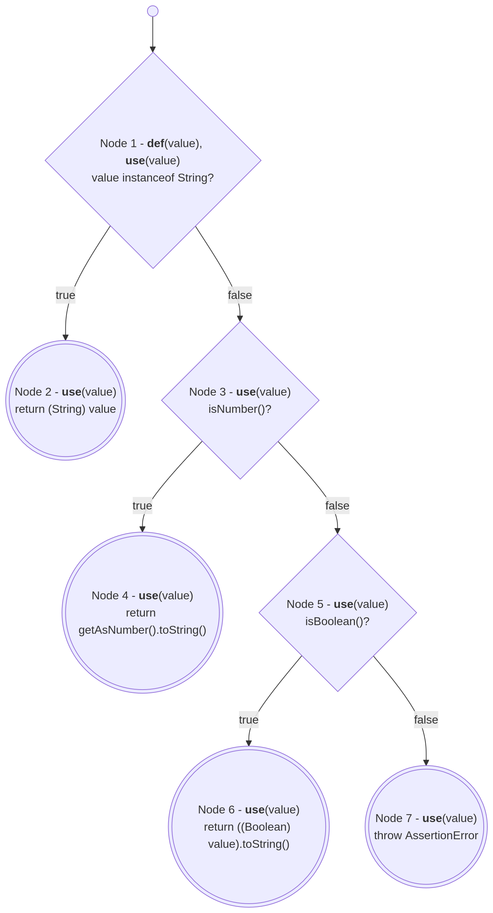
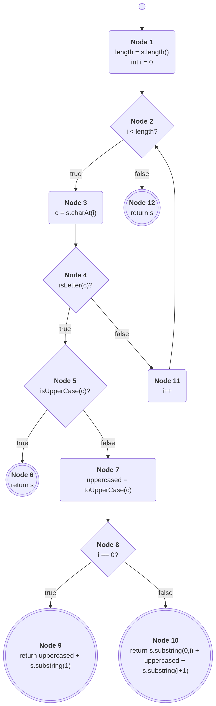
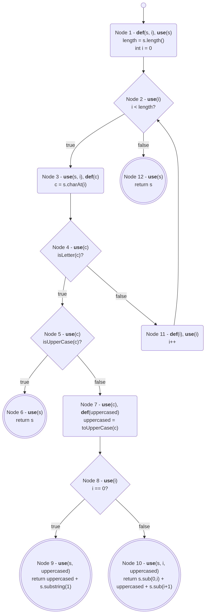

## ToNumberPolicy:parseAsDouble()

`private Number parseAsDouble(String value, JsonReader in) throws IOException`

### ISP

| Characteristic | b1 | b2 | b3 | b4 |
|-|-|-|-|-|
| Parsed result | -Double.MAX_VALUE | Zero | Double.MAX_VALUE | Infinity | NaN |
| Lenient | true | false |

### CFG/DFG



```
0 1 Entry
1 2 T
1 3 F
1 4 catch
3 4 catch
3 5

1:
def = {value, in, d}

2:
use = {d, in}

3:
use = {d}

4:
def = {e}
use = {value, in, e}

ADUPC:
{ (1,2), (1,3,4), (1,3,5), (1,4) }
```

### Logic

`if ((d.isInfinite() || d.isNaN()) && !in.isLenient())`

| d.isInfinite() | d.isNaN() | !in.isLenient() | p |
|-|-|-|-|
| F | F | F | F |
| F | F | T | F |
| F | T | F | T |
| F | T | T | F |
| T | F | F | T |
| T | F | T | F |
| T | T | F | T |
| T | T | T | F |

First determines
| d.isInfinite() | d.isNaN() | !in.isLenient() | p |
|-|-|-|-|
| F | F | F | F |
| T | F | F | T |

Second determines
| d.isInfinite() | d.isNaN() | !in.isLenient() | p |
|-|-|-|-|
| F | F | F | F |
| F | T | F | T |

Third determines
| d.isInfinite() | d.isNaN() | !in.isLenient() | p |
|-|-|-|-|
| F | T | F | T |
| F | T | T | F |
| T | F | F | T |
| T | F | T | F |
| T | T | F | T |
| T | T | T | F |

CACC
| d.isInfinite() | d.isNaN() | !in.isLenient() | p |
|-|-|-|-|
| F | F | F | F |
| F | T | F | T |
| F | T | T | F |
| T | F | F | T |
| T | F | T | F |
| T | T | F | T |
| T | T | T | F |

### Mutation

```
Double d = Double.valueOf(value);
Double d = Double.parseDouble(value);
Double d = null;
Double d = 0.0;

if ((d.isInfinite() || d.isNaN()) && !in.isLenient()) {
if (!((d.isInfinite() || d.isNaN()) && !in.isLenient())) {
if ((d.isInfinite() || d.isNaN()) && in.isLenient()) {
if ((d.isInfinite() && d.isNaN()) || !in.isLenient()) {

} catch (NumberFormatException e) {
} catch (MalformedJsonException e) {

return d;
return null;
return 0.0;
```

## ToNumberPolicy:parseBigDecimal()

`public static BigDecimal parseBigDecimal(String s) throws NumberFormatException`

### ISP

| Characteristic | b1 | b2 | b3 | b4 |
|-|-|-|-|-|
| Parsed result | Empty string | Zero | MAX_NUMBER_STRING_LENGTH | Invalid |

### CFG/DFG



```
0 1 Entry
1 2 T
1 3 F
3 4 T
3 5 F

1:
def = {s}

(1,2):
(1,3):
use = {s}

2:
use = {s}

3:
def = {decimal}
use = {s}

(3,4):
(3,5):
use = {decimal}

4:
use = {s}

5:
use = {decimal}

ADUPC:
{ (1,2), (1,3,4), (1,3,5) }
```

### Logic

`if (s.length() > MAX_NUMBER_STRING_LENGTH)`

| s.length() > MAX_NUMBER_STRING_LENGTH | p |
|-|-|
| T | T |
| F | F |

`if (Math.abs((long) decimal.scale()) >= 10_000)`

| Math.abs((long) decimal.scale()) >= 10_000 | p |
|-|-|
| T | T |
| F | F |

### Mutation

```
checkNumberStringLength(s);
//checkNumberStringLength(s);

BigDecimal decimal = new BigDecimal(s);
BigDecimal decimal = new BigDecimal("0");
BigDecimal decimal = new BigDecimal(null);

if (Math.abs((long) decimal.scale()) >= 10_000) {
if (Math.abs((long) decimal.scale()) > 10_000) {
if (Math.abs((long) decimal.scale()) <= 10_000) {
if (Math.abs((long) decimal.scale()) == 10_000) {
if (Math.abs((long) decimal.scale()) >= 10_000 + 1) {
if (Math.abs((long) decimal.scale()) >= 10_000 - 1) {

throw new NumberFormatException("Number has unsupported scale: " + s);
//throw new NumberFormatException("Number has unsupported scale: " + s);

return decimal;
return null;
```

## ToNumberPolicy:parseBigInteger()

`public static BigInteger parseBigInteger(String s) throws NumberFormatException`

### ISP

| Characteristic | b1 | b2 | b3 | b4 |
|-|-|-|-|-|
| Parsed result | Empty string | Zero | MAX_NUMBER_STRING_LENGTH | Invalid |

### CFG/DFG



```
0 1 Entry
1 2 T
1 3 F

1:
def = {s}

(1,2):
(1,3):
use = {s}

2:
use = {s}

3:
use = {s}

ADUPC:
{ (1,2), (1,3) }
```

### Logic

`if (s.length() > MAX_NUMBER_STRING_LENGTH)`

| s.length() > MAX_NUMBER_STRING_LENGTH | p |
|-|-|
| T | T |
| F | F |

### Mutation

```
checkNumberStringLength(s);
//checkNumberStringLength(s);

return new BigInteger(s);
return new BigInteger("0");
return new BigInteger(null);
return null;
```
***
# Source Code
- JsonPrimitive.java, lines 139-146

```java
public Number getAsNumber() {
  if (value instanceof Number) {          // Line 140
    return (Number) value;                // Line 141
  } else if (value instanceof String) {   // Line 142
    return new LazilyParsedNumber((String) value);  // Line 143
  }
  throw new UnsupportedOperationException("Primitive is neither a number nor a string");  // Line 145
}
```


## ISP

**C1: Type of value**

| Characteristic | b1 | b2 | b3 |
|-|-|-|-|
| Type of value | Number | String | Boolean |

**C2: Number subtype (BVA)**

| Characteristic | b1 | b2 | b3 | b4 | b5 |
|-|-|-|-|-|-|
| Number subtype | Zero `0` | Negative `-1` | MAX_VALUE | Double `3.14` | NaN |

**C3: String content (BVA)**

| Characteristic | b1 | b2 | b3 |
|-|-|-|-|
| String content | Integer `"123"` | Decimal `"3.14"` | Negative `"-42"` |

**C4: Boolean value (BVA)**

| Characteristic | b1 | b2 |
|-|-|-|
| Boolean value | true | false |

## Control Flow



### Node Coverage
| Test | Input | Path     | New Nodes Covered |
| ---- | ----- | -------- | ----------------- |
| T1   | 42    | N1-N2    | N1, N2            |
| T2   | "123" | N1-N3-N4 | N3, N4            |
| T3   | true  | N1-N3-N5 | N5                |

### Edge Coverage
| Test | Path     | Edges Covered |
| ---- | -------- | ------------- |
| T1   | N1-N2    | E1            |
| T2   | N1-N3-N4 | E2, E3        |
| T3   | N1-N3-N5 | E2, E4        |

### Edge-Pair Coverage

| Edge Pair | Tests |
| --------- | ----- |
| (E2, E3)  | T2    |
| (E2, E4)  | T3    |
## Data Flow

### All-Uses Coverage

| Node | def(n) | use(n) |
| ---- | ------ | ------ |
| 1    | value  | value  |
| 2    | -      | value  |
| 3    | -      | value  |
| 4    | -      | value  |
| 5    | -      | -      |
Tests T1, T2, and T3 will satisfy complete coverage.

## Logic-Based Testing

P1: `value instanceof Number`
P2: `value instanceof String`

Each predicate has a single clause, no logical connectives. PC = CC = CACC.

| Predicate | True | False |
|-|-|-|
| P1: `value instanceof Number` | `42` | `"123"` |
| P2: `value instanceof String` | `"123"` | `true` |

CACC: Each clause determines its predicate (no minor clauses).

| Major Clause | c=T (p=?) | c=F (p=?) | Test Pair |
|-|-|-|-|
| C1: `value instanceof Number` | T (p=T) | F (p=F) | `42` / `"123"` |
| C2: `value instanceof String` | T (p=T) | F (p=F) | `"123"` / `true` |

### Mutation

```
if (value instanceof Number) {
if (!(value instanceof Number)) {

} else if (value instanceof String) {
} else if (!(value instanceof String)) {

return (Number) value;
return null;
return 0;

return new LazilyParsedNumber((String) value);
return null;

// swap Number and String checks
if (value instanceof String) {
    return (Number) value;
} else if (value instanceof Number) {
    return new LazilyParsedNumber((String) value);

// delete String branch
// } else if (value instanceof String) {
//   return new LazilyParsedNumber((String) value);

// delete throw
// throw new UnsupportedOperationException(...);

throw new UnsupportedOperationException("Primitive is neither a number nor a string");
throw new IllegalArgumentException("Primitive is neither a number nor a string");
throw new UnsupportedOperationException("Invalid primitive type");
```

# Source Code
- JsonPrimitive.java, lines 159-168

```java
public String getAsString() {
  if (value instanceof String) {          // Line 160
    return (String) value;                // Line 161
  } else if (isNumber()) {               // Line 162
    return getAsNumber().toString();      // Line 163
  } else if (isBoolean()) {              // Line 164
    return ((Boolean) value).toString();  // Line 165
  }
  throw new AssertionError("Unexpected value type: " + value.getClass());  // Line 167
}
```

## ISP

**C1: Type of value**

| Characteristic | b1     | b2     | b3      |
| -------------- | ------ | ------ | ------- |
| Type of value  | String | Number | Boolean |

**C2: String content (BVA)**

| Characteristic | b1         | b2              | b3                     |
| -------------- | ---------- | --------------- | ---------------------- |
| String content | Empty `""` | Normal `"text"` | Numeric-looking `"42"` |

**C3: Number subtype (BVA)**

| Characteristic | b1 | b2 | b3 | b4 | b5 |
|-|-|-|-|-|-|
| Number subtype | Zero `0` | Negative `-1` | MAX_VALUE | Double `3.14` | NaN |

**C4: Boolean value (BVA)**

| Characteristic | b1 | b2 |
|-|-|-|
| Boolean value | true | false |

## Control Flow



### Node Coverage
| Test | Input  | Path        | New Nodes Covered |
| ---- | ------ | ----------- | ----------------- |
| T1   | "text" | N1-N2       | N1, N2            |
| T2   | 42     | N1-N3-N4    | N3, N4            |
| T3   | true   | N1-N3-N5-N6 | N5, N6            |
Node 7 is unreachable in normal operations.
### Edge Coverage
| Test | Path        | Edges Covered |
| ---- | ----------- | ------------- |
| T1   | N1-N2       | E1            |
| T2   | N1-N3-N4    | E2, E3        |
| T3   | N1-N3-N5-N6 | E2, E4, E5    |
Edge 6 is unreachable in normal operations.

### Edge-Pair Coverage

| Edge Pair | Tests |
|---|---|
| (E2, E3) | T2 |
| (E2, E4) | T3 |
| (E4, E5) | T3 |

## Data Flow




### All-Uses Coverage

| Node | def(n) | use(n) |
| ---- | ------ | ------ |
| 1    | value  | value  |
| 2    | -      | value  |
| 3    | -      | value  |
| 4    | -      | value  |
| 5    | -      | value  |
| 6    | -      | value  |
| 7    | -      | value  |

Tests T1, T2, and T3 will satisfy complete coverage.

## Logic-Based Testing

P1: `value instanceof String`
P2: `isNumber()`
P3: `isBoolean()`

Each predicate has a single clause, no logical connectives. PC = CC = CACC.

| Predicate                     | True     | False       |
| ----------------------------- | -------- | ----------- |
| P1: `value instanceof String` | `"text"` | `42`        |
| P2: `isNumber()`              | `42`     | `true`      |
| P3: `isBoolean()`             | `true`   | Unreachable |

CACC: Each clause determines its predicate (no minor clauses).

| Major Clause                  | c=T (p=?) | c=F (p=?) | Test Pair            |
| ----------------------------- | --------- | --------- | -------------------- |
| C1: `value instanceof String` | T (p=T)   | F (p=F)   | `"text"` / `42`      |
| C2: `isNumber()`              | T (p=T)   | F (p=F)   | `42` / `true`        |
| C3: `isBoolean()`             | T (p=T)   | F (p=F)   | `true` / unreachable |

### Mutation

```
if (value instanceof String) {
if (!(value instanceof String)) {

} else if (isNumber()) {
} else if (!isNumber()) {

} else if (isBoolean()) {
} else if (!isBoolean()) {

return (String) value;
return "";
return null;
return value.toString();

return getAsNumber().toString();
return String.valueOf(getAsNumber().hashCode());

// swap isNumber() and isBoolean() branches
} else if (isBoolean()) {
    return ((Boolean) value).toString();
} else if (isNumber()) {
    return getAsNumber().toString();

// delete Number branch entirely
// } else if (isNumber()) {
//   return getAsNumber().toString();

// delete Boolean branch entirely
// } else if (isBoolean()) {
//   return ((Boolean) value).toString();
```

## Source Code
- FieldNamingPolicy.java, lines 192-212

```java
static String upperCaseFirstLetter(String s) {
  int length = s.length();                        // Line 193
  for (int i = 0; i < length; i++) {              // Line 194
    char c = s.charAt(i);                         // Line 195
    if (Character.isLetter(c)) {                  // Line 196
      if (Character.isUpperCase(c)) {             // Line 197
        return s;                                 // Line 198
      }
      char uppercased = Character.toUpperCase(c); // Line 201
      if (i == 0) {                               // Line 203
        return uppercased + s.substring(1);       // Line 204
      } else {
        return s.substring(0, i) + uppercased + s.substring(i + 1);  // Line 206
      }
    }
  }
  return s;                                       // Line 211
}
```


## ISP

**C1: Content of first letter**

| Characteristic          | b1         | b2                       | b3                       | b4                 |
| ----------------------- | ---------- | ------------------------ | ------------------------ | ------------------ |
| Content of first letter | Empty `""` | Lowercase first `"text"` | Uppercase first `"Text"` | No letters `"123"` |

**C2: Position of first letter (BVA)**

| Characteristic           | b1            | b2             | b3                |
| ------------------------ | ------------- | -------------- | ----------------- |
| Position of first letter | i==0 `"text"` | i==1 `"_text"` | No letter `"123"` |

**C3: String length (BVA)**

| Characteristic | b1 | b2 | b3 |
|-|-|-|-|
| String length | 0 `""` | 1 lowercase `"a"` | 1 non-letter `"9"` |

## Control Flow


### Node Coverage
| Test | Input   | Path                               | New Nodes Covered |
| ---- | ------- | ---------------------------------- | ----------------- |
| T1   | ""      | N1-N2-N12                          | N1, N2, N12       |
| T2   | "Text"  | N1-N2-N3-N4-N5-N6                  | N3, N4, N5, N6    |
| T3   | "text"  | N1-N2-N3-N4-N5-N7-N8-N9            | N7, N8, N9        |
| T4   | "_text" | N1-N2-N3-N4-N11-N2-N4-N5-N7-N8-N10 | N10, N11          |
### Edge Coverage
| Test | Input   | Path                                 |
| ---- | ------- | ------------------------------------ |
| T1   | ""      | E1, E2                               |
| T2   | "Text"  | E1, E3, E4, E5, E7                   |
| T3   | "text"  | E1, E3, E4, E5, E8, E9, E10          |
| T4   | "_text" | E1, E3, E4, E5, E6, E8, E9, E11, E12 |
| T5   | "123"   | E1, E3, E4, E6, E12, E2              |
### Edge-Pair Coverage
| Edge Pair | Tests      |
| --------- | ---------- |
| E1, E2    | T1         |
| E1, E3    | T2, T3, T4 |
| E3, E4    | T2, T3, T4 |
| E4, E5    | T2, T3     |
| E4, E6    | T4, T5     |
| E5, E7    | T2         |
| E5, E8    | T3, T4     |
| E6, E12   | T4, T5     |
| E8, E9    | T3, T4     |
| E9, E10   | T3         |
| E9, E11   | T4         |
| E12, E2   | T5         |
| E12, E3   | T4, T5     |
## Data Flow


### All-Uses Coverage

| Node | def(n)     | use(n)           |
| ---- | ---------- | ---------------- |
| 1    | s, i       | s                |
| 2    | -          | i                |
| 3    | c          | s, i             |
| 4    | -          | c                |
| 5    | -          | c                |
| 6    | -          | s                |
| 7    | uppercased | c                |
| 8    | -          | i                |
| 9    | -          | s, uppercased    |
| 10   | -          | s, i, uppercased |
| 11   | i          | i                |
| 12   | -          | s                |
Tests T1, T2, T3, T4, and T5 will satisfy complete coverage.

## Logic-Based Testing

P1: `i < length`
P2: `Character.isLetter(c)`
P3: `Character.isUpperCase(c)`
P4: `i == 0`

Each predicate has a single clause, no logical connectives. PC = CC = CACC.

| Predicate            | True     | False     |
| -------------------- | -------- | --------- |
| P1: `i < length`     | `"Text"` | `""`      |
| P2: `isLetter(c)`    | `"Text"` | `"123"`   |
| P3: `isUpperCase(c)` | `"Text"` | `"text"`  |
| P4: `i == 0`         | `"text"` | `"_text"` |

CACC: Each clause  determines its predicate (no minor clauses).

| Major Clause | c=T (p=?) | c=F (p=?) | Test Pair |
|-|-|-|-|
| C1: `i < length` | T (p=T): `"a"` | F (p=F): `""` | `"a"` / `""` |
| C2: `isLetter(c)` | T (p=T): `"a"` | F (p=F): `"1a"` | `"a"` / `"1a"` |
| C3: `isUpperCase(c)` | T (p=T): `"A"` | F (p=F): `"a"` | `"A"` / `"a"` |
| C4: `i == 0` | T (p=T): `"abc"` | F (p=F): `"_abc"` | `"abc"` / `"_abc"` |

## Mutation

```
for (int i = 0; i < length; i++) {
for (int i = 0; i <= length; i++) {
for (int i = 0; i > length; i++) {

if (Character.isLetter(c)) {
if (!Character.isLetter(c)) {

if (Character.isUpperCase(c)) {
if (!Character.isUpperCase(c)) {

if (i == 0) {
if (i != 0) {

char uppercased = Character.toUpperCase(c);
char uppercased = Character.toLowerCase(c);

return uppercased + s.substring(1);
return uppercased + s.substring(0);

return s.substring(0, i) + uppercased + s.substring(i + 1);
return s.substring(0, i) + uppercased + s.substring(i);

return s;  // line 198
// return s;  // deleted
return null;

return s;  // line 211
// return s;  // deleted
return "";
```

***
